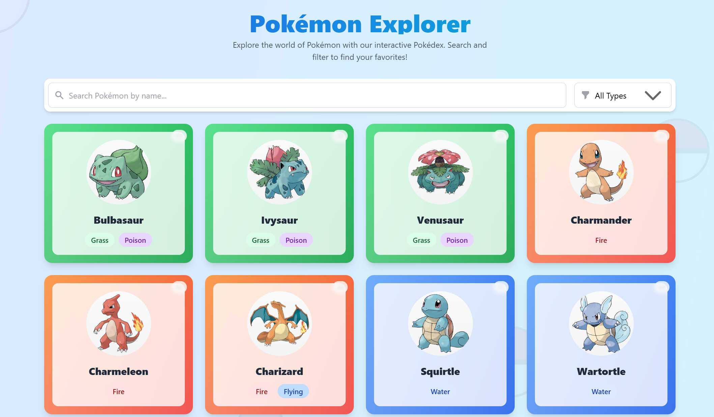
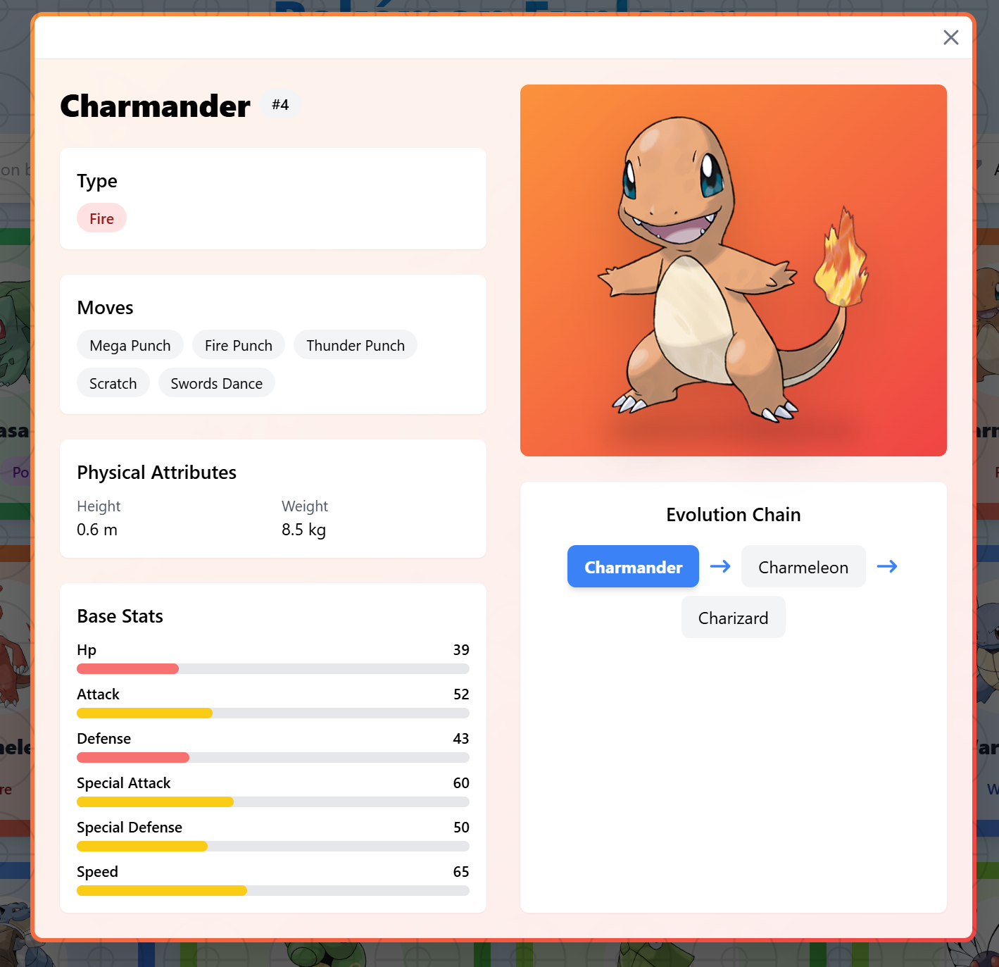

# Dexpro ✨
*Pokédex + Explorer*

[](https://dexplorer-pokemon.vercel.app/)

A modern, feature-rich web application for exploring the world of Pokémon! Built with React, this interactive Pokédex offers comprehensive Pokémon data with beautiful animations and an intuitive user experience.


## ✨ Features

### 🔍 **Exploration & Discovery**
- Browse through the original 250+ Pokémon with lightning-fast search
- Advanced filtering by Pokémon types (Fire, Water, Grass, etc.)
- Intelligent search suggestions and instant results
- Responsive design that works perfectly on all devices

### 📊 **Detailed Pokémon Information**
- **Complete Stats**: Base stats with interactive visual bars
- **Type Information**: Color-coded type badges with gradients
- **Physical Attributes**: Height, weight, and measurements
- **Move Sets**: Display of Pokémon abilities and moves
- **Evolution Chains**: Interactive evolution tree visualization
- **High-Quality Images**: Official artwork and sprites

### ❤️ **Favorites System**
- Save your favorite Pokémon to a personal collection
- Persistent favorites using local storage
- Quick access through dedicated favorites page
- Visual indicators for favorited Pokémon

### ⚔️ **Pokémon Comparison**
- Side-by-side stat comparison between any two Pokémon
- Interactive comparison table with difference calculations
- Visual stat comparisons to help with team building

### 🎨 **Beautiful UI/UX**
- Smooth animations powered by Framer Motion
- Type-themed color schemes and gradients
- Loading animations with custom Pokéball spinner
- Hover effects and micro-interactions
- Mobile-first responsive design

## �️ Tech Stack

- **Frontend**: React 18 with modern hooks and Context API
- **Routing**: React Router DOM v7 for seamless navigation
- **Styling**: Tailwind CSS for responsive design
- **Animations**: Framer Motion for smooth interactions
- **HTTP Client**: Axios with retry logic and timeout handling
- **State Management**: React Context + Custom Hooks
- **Data Source**: PokéAPI for authentic Pokémon data
- **Build Tool**: Vite for fast development and building
- **Package Manager**: npm

## 📁 Project Structure

```
src/
├── components/
│   ├── cards/
│   │   ├── ComparisonCard.jsx
│   │   └── PokemonCard.jsx
│   ├── layout/
│   │   ├── Footer.jsx
│   │   └── Header.jsx
│   ├── ui/
│   │   ├── Pagination.jsx
│   │   ├── SearchBar.jsx
│   │   ├── SortSelector.jsx
│   │   └── TypeFilter.jsx
│   ├── PokemonAttributes.jsx
│   ├── PokemonDetail.jsx
│   ├── PokemonEvolution.jsx
│   ├── PokemonImage.jsx
│   ├── PokemonMoves.jsx
│   ├── PokemonStats.jsx
│   └── PokemonTypes.jsx
├── context/
│   ├── FavoritesContext.jsx
│   └── PokemonDataContext.jsx
├── hooks/
│   ├── useFavorites.js
│   ├── useFiltering.js
│   ├── usePagination.js
│   ├── useRandomPokemon.js
│   └── useSorting.js
├── pages/
│   ├── ComparisonPage.jsx
│   ├── DetailPage.jsx
│   ├── FavoritesPage.jsx
│   ├── HomePage.jsx
│   └── NotFoundPage.jsx
├── utils/
│   ├── api.js
│   ├── helpers.js
│   └── localStorage.js
├── App.jsx
├── main.jsx
├── router.jsx
└── index.css
```

## 🚀 Try It Now!

**[Launch Dexplorer →](https://dexplorer-pokemon.vercel.app/)**

## 📱 Screenshots

<details>
<summary><b>Show me the interface!</b> (Click to expand)</summary>

### 🏠 Main Dashboard

*Browse and search through hundreds of Pokémon with advanced filtering*

### 🃏 Pokémon Cards

*Beautiful type-themed cards with smooth animations*

### 📋 Detailed View
*Comprehensive Pokémon information including stats, moves, and evolution chains*

### ⚔️ Comparison Tool
*Side-by-side stat comparison for team building and analysis*

### ❤️ Favorites Collection
*Personal collection of your favorite Pokémon*

</details>

## ❓ FAQ

<details>
<summary><b>How many Pokémon are available?</b></summary>
The app includes over 250 Pokémon from multiple generations, starting with the original 151 from Generation 1.
</details>

<details>
<summary><b>Where does the data come from?</b></summary>
All Pokémon information is sourced from the official PokéAPI, ensuring accurate and up-to-date data including stats, types, moves, and evolution chains.
</details>

<details>
<summary><b>Can I save my favorite Pokémon?</b></summary>
Yes! The app includes a fully functional favorites system that saves your selections locally. You can access your favorites through the dedicated favorites page.
</details>

<details>
<summary><b>Can I compare Pokémon?</b></summary>
Absolutely! The comparison feature lets you analyze any two Pokémon side-by-side, including detailed stat comparisons and visual differences.
</details>

<details>
<summary><b>Is the app mobile-friendly?</b></summary>
Yes! Dexplorer is built with a mobile-first approach and works seamlessly across phones, tablets, and desktops with responsive design.
</details>

<details>
<summary><b>Are there any animations?</b></summary>
The app features smooth animations throughout, including card hover effects, loading animations, page transitions, and interactive elements powered by Framer Motion.
</details>

## � Getting Started

### Prerequisites
- Node.js 18+ 
- npm or yarn package manager

### Installation

1. **Clone the repository**
   ```bash
   git clone https://github.com/noviciusss/Dexplorer.git
   cd Dexplorer
   ```

2. **Install dependencies**
   ```bash
   npm install
   ```

3. **Start the development server**
   ```bash
   npm run dev
   ```

4. **Open your browser**
   Visit `http://localhost:5173` to see the app in action!

### Build for Production
```bash
npm run build
npm run preview
```

## 🔮 Roadmap

### ✅ **Currently Available**
- [x] Pokémon browsing and search
- [x] Type-based filtering
- [x] Detailed Pokémon information
- [x] Evolution chain visualization
- [x] Favorites system with persistence
- [x] Pokémon comparison tool
- [x] Responsive design
- [x] Smooth animations

### 🚧 **In Development**
- [ ] Dark mode theme
- [ ] Advanced search filters (generation, stats range)
- [ ] Team builder functionality
- [ ] Pokémon type effectiveness chart
- [ ] Move details and descriptions

### 💡 **Future Features**
- [ ] User accounts and cloud sync
- [ ] Pokémon locations and habitats
- [ ] Battle simulator
- [ ] Achievement system
- [ ] Social features (share favorites/teams)
- [ ] Expanded Pokémon database (all generations)

## 🤝 Contributing

Contributions are welcome! Feel free to:

1. **Report bugs** or suggest features via [Issues](https://github.com/noviciusss/Dexplorer/issues)
2. **Submit Pull Requests** for bug fixes or new features
3. **Improve documentation** or add examples
4. **Share feedback** and ideas for enhancements

### Development Guidelines
- Follow existing code style and conventions
- Add comments for complex logic
- Test your changes thoroughly
- Update documentation if needed

## 👋 About the Creator

**Built with ❤️ by [Noviciusss](https://github.com/noviciusss)**

I'm passionate about creating engaging web experiences that combine beautiful design with practical functionality. This project represents my journey in modern React development and my love for Pokémon!

### Connect with me:
- **GitHub**: [@noviciusss](https://github.com/noviciusss)
- **Project Repository**: [Dexplorer](https://github.com/noviciusss/Dexplorer)

Love the app? Found it useful? **⭐ Star the repository** to show your support!

Got suggestions or found a bug? [Open an issue](https://github.com/noviciusss/Dexplorer/issues) – I'd love to hear from you!

---

<div align="center">
  
**🔗 Quick Links**

[**🌐 Live Demo**](https://dexplorer-pokemon.vercel.app/) | [**📱 GitHub**](https://github.com/noviciusss/Dexplorer) | [**🐛 Report Bug**](https://github.com/noviciusss/Dexplorer/issues) | [**✨ Request Feature**](https://github.com/noviciusss/Dexplorer/issues)

*Gotta catch 'em all! 🎯*

</div>
